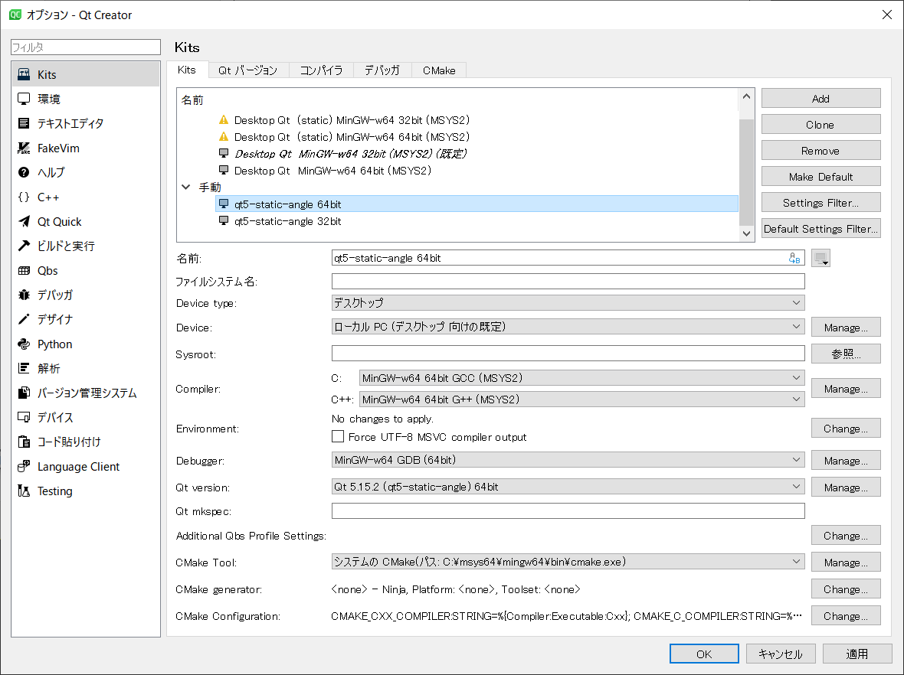

= PC6001VX マニュアル
eighttails <http://eighttails.seesaa.net>
:toc-title: 目次
:toc: left
:numbered:
:data-uri:
:icons: font

== はじめに
image::doc/overview.png[]

本プログラムは、 http://papicom.net[ゆみたろ様]作のPC-6001エミュレータ
PC6001VをLinux等で動作するよう改変したものです。 +
PC6001VXの末尾のXはクロスプラットフォームのXです。(^^; +
ターゲットはLinuxなどのUNIXライクOSおよびAndroidを想定していますが、移植性の検証としてWindows用バイナリもリリースしています。が、こちらはほとんどおまけです。 +

== 起動方法
=== 必要なもの
* ROMファイル +
エミュレータの動作には原則として、PC-6001シリーズの実機から吸い出したROMファイルが必要になります。 http://p6ers.net/hashi/suidashi.html[こちら]を参考にして実機から吸い出してください。 +
実機をお持ちでない場合、 http://000.la.coocan.jp/p6/basic.html[秋川様]作成の互換ROMを使うという選択肢もあります。互換ROMはエミュレータのバイナリに内蔵されており、設定で有効化することができます。 +
互換ROM使用時は初代PC-6001、PC-6001mk2、PC-6601いずれかに相当する動作になります。 +
必要なROMファイルは以下の通りです。 +
[WARNING]
Windows以外ではファイル名の大文字小文字が間違っていると起動しなくなります。ご注意ください。 

** PC-6001の場合
+
[options="header"]
|================
|ファイル名|サイズ|CRC32|対応ROM
|BASICROM.60|16KB|54C03109|N60-BASICインタプリタROM
|CGROM60.60|4KB|B0142D32|N60-BASIC用CGROM
|================

** PC-6001Aの場合
+
[options="header"]
|================
|ファイル名|サイズ|CRC32|対応ROM
|BASICROM.61|16KB|FA8E88D9|N60-BASICインタプリタROM
|CGROM60.61|4KB|49C21D08|N60-BASIC用CGROM
|================

** PC-6001mk2の場合
+
[options="header"]
|================
|ファイル名|サイズ|CRC32|対応ROM
|BASICROM.62|32KB|950AC401 +
D7E61957|N60m-BASICインタプリタROM(*1)
|CGROM60.62|8KB|81EB5D95|N60-BASIC用CGROM
|CGROM60m.62(*2)|8KB|3CE48C33|N60m-BASIC用CGROM
|KANJIROM.62|32KB|20C8F3EB|漢字ROM
|VOICEROM.62|16KB|49B4F917|音声合成ROM
|================
*1 PC-6001mk2の BASICROM.62 は2種類存在することを確認しています。 +
バージョンはどちらも1.7ですが細かなバグ修正が行われたようです。  +
*2 ファイル名の60mは小文字であることに注意してください。

** PC-6601の場合
+
[options="header"]
|================
|ファイル名|サイズ|CRC32|対応ROM
|BASICROM.66|32KB|C0B01772|N66-BASICインタプリタROM
|CGROM60.66|8KB|D2434F29|N60-BASIC用CGROM
|CGROM66.66|8KB|3CE48C33|N66-BASIC用CGROM
|KANJIROM.66|32KB|20C8F3EB|漢字ROM
|VOICEROM.66|16KB|91D078C1|音声合成ROM
|================

** PC-6001mk2SRの場合
+
[options="header"]
|================
|ファイル名|サイズ|CRC32|対応ROM
|SYSTEMROM1.64|64KB|B6FC2DB2|N66/N66SR-BASIC ROM
|SYSTEMROM1.64|64KB|55A62A1D|音声合成，漢字，その他ROM
|CGROM68.64|16KB|73BC3256|BASIC用CGROM
|================

** PC-6601SRの場合
+
[options="header"]
|================
|ファイル名|サイズ|CRC32|対応ROM
|SYSTEMROM1.68|64KB|B6FC2DB2|N66/N66SR-BASIC ROM
|SYSTEMROM1.68|64KB|55A62A1D|音声合成，漢字，その他ROM
|CGROM68.68|16KB|73BC3256|BASIC用CGROM
|================

* WAVファイル +
mk2以降の場合、音声合成の固定語はWAVファイルとして用意する必要があります。 +
実機のモード5または6で「talk"f41."」を実行し、その音声をf41.wavの名前で録音して保存してください。 +
同様にf42~f44.wavも用意します。 +
WAVファイルのフォーマットですが、作者は44kHzモノラルのWAVで動作確認しています。 +
WAVファイルがない場合、固定語が再生されません。 +

=== 初回起動時の設定
必要なファイルが揃ったらPC6001VXを起動してください。起動の方法はお使いのOSに合わせたプラットフォーム固有情報を参照してください。 +
初回起動時には以下のエラーが出ると思います。 +

image::doc/firstboot.png[]

ROMファイルはここで提示されたフォルダ内を探しに行くので、その場所にROMファイルをコピーするか、すでに別の場所にROMファイルを用意していれば、その場所を参照するように設定を変更することができます。設定を変更する場合は「Yes」をクリックしてROMファイルのあるフォルダを指定してください。 +

ここで「No」をクリックした場合、以下のダイアログが表示されます。 +

image::doc/compatiblerom.png[]

ここで「Yes」を選択するとエミュレータのバイナリに内蔵された互換ROMを使って起動します。実機から吸い出したROMをお持ちでない場合はこちらを使ってください。 +
初期状態ではPC-6001相当の動作になりますが、設定画面でPC-6601相当のROMを選択することもできます。

指定したROMファイルのCRCが一般に知られているものと合わない場合、以下のメッセージが表示されます。 +

image::doc/romcrc.png[]

警告されますが「Yes」をクリックすると以降ROMのCRCチェックをせずに起動するようになります。 +
ただしこの後の動作は自己責任です。 +

=== プラットフォーム固有情報
==== Windows
* 起動方法 +
普通にPC6001VX.exeをダブルクリックして起動してください。
* 起動しない時は +
** iniファイルを削除してください。 +
** それでも起動しない時はsafemode.batを使用してください。 +
safemode.batでは設定ファイルを削除し、セーフモード(表示のハードウェアアクセラレーションを一時的にオフ)で起動します。 +
グラフィックボードが古くて画面が表示できない環境の人は、セーフモードで立ち上げて、設定画面からハードウェアアクセラレーションをオフに設定してください。 +
* 設定、各種ファイル生成場所 +
exeファイルと同じフォルダにiniファイル、各種フォルダが生成されます。

==== Linux
* 起動方法 +
ソースからビルドして実行してください。ビルドの仕方については開発者情報の章を参照してください。 +
* 設定、各種ファイル生成場所 +
~/.pc6001vxフォルダ以下にiniファイル、各種フォルダが生成されます。 +

==== Android
* 起動方法 +
アプリケーションメニュー内に登録されたPC6001VXのアイコンをタップすると起動します。 +
* 設定、各種ファイル生成場所 +
Androidの場合設定ファイルの生成場所は機種依存になり、一概に言えませんが、通常のファイルマネージャではアクセスできない場所に作成されることが多いようです。具体的な場所は環境設定ダイアログで確認してください。 +

== 使い方
=== メニュー
エミュレータのメイン画面上でマウスを右クリックするとメニューが表示されます。 +
Androidではメイン画面上でタップするとメニューが出ます。 +

image::doc/menu.png[]

* システム +
** リセット +
エミュレータをリセットします。 +

** 再起動 +
エミュレータを再起動します。 +
設定変更を反映するには再起動が必要です。 +

** 一時停止 +
エミュレーターを一時停止します。
** スナップショットを取得
現在のエミュレータの画面を画像ファイルとして保存します。 +
保存先は設定ダイアログの「フォルダ」タブ中の「SnapShot」の項目で設定したフォルダになります。 +

** 速度調整 +
エミュレーターの動作速度を調整します。 +
メニューにいくつかプリセットが用意されていますが、数値入力で10%から2000%まで指定することができます。 +

** どこでもLOAD +
** どこでもSAVE +
現在のP6の状態をそっくりそのまま保存して，あとで再開できます。 +
ノートパソコンのレジュームやサスペンドと呼ばれる機能と同じようなものです。 +
セーブするためのファイルは任意の名前(.ddr)をつけることができる他、1〜3番のスロットを用意しています。 +
1番のスロットSAVEデータは(どこでもSAVEフォルダ)/1.ddrとして保存されます。2,3番も同様です。 +
[WARNING]
この機能はまだまだ未完成です。TAPEやDISKに書き込んでいる最中などは全く考えていませんのでイメージを破壊する可能性が大です。ご注意ください。
[WARNING]
どこでもSAVEファイルにはメモリの内容が含まれますので著作権者の許可なく配布しないでください。

** リプレイ +
リプレイのメニューはその時の状態により変化します。 +
*** [通常時] +
**** 再生 +
**** 記録 +
**** 記録再開 +
以前記録したリプレイの記録終了時にresumeファイルが残っていれば「記録再開」でリプレイの続きを記録停止したところから記録することができます。
**** リプレイを動画に変換 +
保存済みのリプレイファイルを動画に変換します。 +
最初に変換対象のリプレイファイルを選択し、次に動画の保存先を指定します。 +
するとリプレイを再生しながら動画のエンコードを開始します。リプレイが終了したら自動的に動画のエンコードも終了します。

*** [再生中] +
**** 再生停止 +
リプレイの再生を停止します。

*** [記録中] +
**** 記録停止 +
記録を停止します。 +
停止時には途中保存と同じ「(リプレイファイル名).resume」ファイルを残します。 +

**** 途中保存 +
リプレイの記録中に、その途中の状態を保存することができます。 +
「(リプレイファイル名).resume」ファイルをリプレイファイル(.ddr)と同じフォルダに残します。 +

**** 途中保存から再開 +
ゲームのリプレイ記録中に失敗した場合など、リプレイの記録を停止せずに「途中保存」した地点に戻ってやり直すことができます。 +

**** １つ前の途中保存から再開 +
ゲームのリプレイ記録中に失敗した場合、「途中保存から再開」で戻っても、途中保存の時点で詰んでしまって進めなくなることが時々あります。「途中保存」は5個まで過去の履歴を保存していますので、1つ前の途中保存からやり直すことができます。 +
これを実行した場合、最新の途中保存は失われます。 +

** ビデオキャプチャ +
エミュレータの動作を動画ファイルとして記録します。 +
記録を終了するにはもう一度このメニュー(「ビデオキャプチャ停止」に変わっています)を選択します。 +
動画の記録方式はWebM形式です。(MP4形式はライセンス面でリスクがあるため、対応を見送っています。) 世の中ではあまり使われていない形式ですが、YouTubeは正式に対応しています。ニコニコ動画は正式対応をうたってはいませんが、実はアップロードには対応しています。 +
動画の記録中は動作速度が極端に落ちるため(作者の環境で1/10くらい)、ゲームをプレイしながら動画にするといった使い方は現時点では無理です。 +
あらかじめプレイをリプレイとして記録しておき、そのリプレイを再生しながら動画にするといった使い方を想定しています。(動画の記録中にリプレイが終了した場合、その時点で動画の記録も終了します。) +
マシンの処理速度にかかわらず、出来上がった動画は60FPSになります。 +

** キーパネル
+
image::doc/keypanel.png[]
英語キーボードやモバイル機のキーボードで入力できないことが多いキーをボタンで入力できる補助キーパネルを表示します。 +
ボタンはシフトキーと同時押しでも機能します。シフトキーを押してF1ボタンを押すとF6キーとして機能します。 +

** 仮想キーボード
+
image::doc/virtualkey.png[]
タッチスクリーンで利用できる仮想キーボードを表示します。 +
NORMALタブでは実機のキーボードを模したレイアウト、SIMPLEタブではゲーム用に簡略化したレイアウトを表示します。 +
仮想キーボード上部のボタンはよく使う機能のショートカットになっています。 +
*** SAVE 
どこでもSAVE(1番スロットを使用) +
*** PAUSE 
エミュレーターの一時停止 +
*** SNP 
スナップショットの保存 +
Androidの場合は他のアプリへの画像の共有になります。 https://play.google.com/store/apps/details?id=com.lonelycatgames.Xplore&hl=ja[X-plore File Manager]などの一部のファイルマネージャーアプリに送るとSDカードに画像を保存できます。 +
*** LOAD
どこでもLOAD(1番スロットを使用) +

+
[WARNING]
====
* AndroidおよびWindows10で動作確認しています。
* 現時点ではキーリピートに対応していません。
* NORMALモードでまともに操作するには最低5インチの画面サイズが必要でしょう。
* Windows10ではエミュレーターのフルスクリーンをオフにしてタブレットモードに切り替えると自然な表示になります。
====

** 打ち込み代行 +
テキストファイルから自動入力する機能です。 +
対応しているファイルはtxt2bas仕様準拠です。 +

** 終了 +
PC6001VXを終了します。 +

* TAPE +
テープイメージの挿入、取り出しの操作をします。 +
対応するイメージファイルはP6T形式ですが、P6,CAS形式のファイルもマウントできます。 +

** 挿入 +
テープイメージファイルをマウントします。 +

** 取出 +
テープイメージファイルを取り出します。 +

** TAPE(SAVE)をエクスポート +
SAVE用のテープイメージはLOAD用途は別のファイルとして保存されますが、そのファイルに任意の名前を付けて任意のフォルダに保存できます。 +
Androidの場合は他のアプリへのファイルの共有になります。 https://play.google.com/store/apps/details?id=com.lonelycatgames.Xplore&hl=ja[X-plore File Manager]などの一部のファイルマネージャーアプリに送るとSDカードにTAPEイメージを保存できます。 +

* DISK +
ディスクイメージの挿入、取り出しの操作をします。 +
対応するイメージファイルはd88形式です。 +
操作はTAPEと同様です。 +

* 拡張ROM +
拡張ROMイメージの挿入、取り出しの操作をします。 +
操作はTAPEと同様です。 +

* ジョイスティック +
ジョイスティックがつながっている場合、P6のジョイスティック1,2に対する割り当てを設定します。 +

* 設定 +
** 表示サイズ +
*** 50%~300％ +
表示倍率を変えることができます。 +

*** 倍率を指定 +
数値を直接入力することで任意の倍率で表示することができます。 +

*** 倍率を固定 +
通常はウィドウサイズを変更するとそれに追従して表示倍率が変わるようになっていますが、このチェックボックスをオンにすると、ウィンドウサイズにかかわらず固定のサイズで表示されるようになります。 +

** フルスクリーン +
フルスクリーンモードに切り替えます。 +

** ステータスバー +
ステータスバーの表示を切り替えます。 +

** 4:3表示 +
一般的にPCのアスペクトレシオ(ドットの縦横比)は1:1です。 +
それに対してテレビの場合は 1.16:1 で ちょっと縦長なんだそうです。 +
そのためPC上でそのまま表示すると横長に表示されてしまいます。 +
そこで縦方向を1.16倍に引伸ばして表示するのが 4:3表示 です。 +

** スキャンライン +
P6の水平周波数はテレビと同じ15kHzです。 +
テレビでは走査線を偶数フィールドと奇数フィールドに分け飛び飛びに表示させる インターレース方式 を使っています。 +
しかしP6を含む一般的なパソコンの場合，ちらつきを抑えるため、偶数走査線と奇数走査線が同じ位置を走査する ノンインターレース方式 を使っています。 +
この場合，走査線数が半分になるため走査線と走査線の間に隙間が空いたような状態になります。
この隙間を再現するのが スキャンラインモード です。 +
エミュレータでスキャンラインモードを実現するためには実機の倍の画面解像度を必要とします。（実機が 320X200 なら 640X400 以上） +
当然，表示が重くなるため処理速度が落ちます。 +

** ハードウェアアクセラレーション +
画面表示にハードウェアアクセラレーション(WindowsではDirectX,それ以外ではOpenGL)を使用する場合チェックします。 +
デフォルトはオンです。描画に不具合がある場合はオフにしてください。ただしその場合、画面を高倍率で拡大すると処理が重くなります。 +

** フィルタリング +
グラフィックの拡大表示、4:3表示に際してフィルタリングを適用します。デフォルトはオンです。 +
非整数倍拡大を自然に見せるための措置ですが、ボケた表示は嫌だという方は下記の手順でカクカク表示にできます。 +

. フィルタリングをオフにします。 +
. 4:3表示をオフにします。 +
. 表示サイズを整数倍にします。 +

** TILTモード +
+
image::doc/tilt.png[]
3DS版のスペースハリアーに触発されて作ったジョーク機能です。 +
ジョイスティック、カーソルキーの左右に反応して、画面が傾きます。(笑 +
フルスクリーン時、またはステータスバー非表示の時はディスプレイ枠が表示されます。初代機の場合はPC-6042、それ以外の場合はPC-60m43が表示されます。 +

** モード4カラー +
BASICモード1〜4時のスクリーンモード4のにじみ色を選択します。 +

** フレームスキップ +
エミュレータのフレームスキップ間隔を指定します。 +

** ウェイト無効 +
エミュレータのウェイトを無効化し、全速力で動かします。 +

** Turbo Tape +
TAPEの読込み中はノーウェイトで動作させる機能です。 +
リレーがONになっている間だけノーウェイトになり、リレーOFFと同時に通常動作に戻ります。 +
ただ高速動作させるだけなので，タイミングが変わりにくく信頼性が高い反面、遅いマシンでは十分な効果が得られない場合があります。 +

** Boost Up +
TAPEの転送速度は1200ボーですが，これはTAPEという媒体の信頼性の問題とサブCPUの処理能力から決まってくるようです。 +
メインCPU（Z80）側には余裕があるらしく，待ち時間が結構あります。 +
そこでBASICのワークエリアを監視し，待ちに入ったら即座に次のデータを送るようにすることで無駄な待ち時間を減らし,効率よく読込めるようになります。 +
いろいろ試した感じでは N60で9倍, N60mで5倍 程度の効果が得られました。 +
BASICモードにより限界が異なるのは 内部処理の違いと思われます。 +
倍率は[設定]-[環境設定]-[その他]で変更することが出来ます。 +
確実に高速化する反面，タイミングがシビアなソフトでは取りこぼしが発生したりROM内ルーチンを使用しない独自ローダーでは全く使えない場合があります。 +
万能ではありませんので適宜使い分けてください +

** 環境設定 +
環境設定ダイアログを表示します。詳細は環境設定の章を参照ください。 +

* デバッグ +
** モニタモード +
+
image::doc/monitormode.png[]
デバッグ用にレジスタ、メモリの状態の参照、ステップ実行をできるモードです。 +
「?」を入力するとヘルプが表示されます。 +

* ヘルプ  +
** オンラインヘルプ +
オンラインヘルプを表示します。 +
WindowsではローカルのHTML、それ以外ではGitHub上のREADMEを表示します。 +

** バージョン情報 +
+
image::doc/about.png[]
バージョン情報ダイアログを表示します。 +

** About Qt +
PC6001VXに組み込んでいるQtのバージョンを表示します。 +

** システム情報 +
PC6001VXが現在動作している環境に関する情報を表示します。(バグ報告用) +
「Copy」ボタンを押すとテキストをクリップボードにコピーします。 +

** 設定初期化 +
設定を初期状態に戻します。 +
初期化後は一旦終了するのでもう一度起動してください。

=== キーボードショートカット
.PC-6001シリーズ特有のキー
[options="header"]
|=================================
|キー|機能
|[PageUp]|PAGE(↓↑)
|[End]|STOP
|[ALT]|GRAPH
|[Pause] +
[カタカナ/ひらがな]|かな
|[PageDown]|MODE
|[ScrollLock]|CAPS
|=================================

.各種機能キー
[options="header"]
|=================================
| キー | 機能
|[F6]|モニタモード
|[ALT]+[F6]|フルスクリーン切替え
|[F7]|スキャンライン切替え
|[ALT]+[F7]|4:3表示切替え
|[F8]|モード４カラー切替え
|[ALT]+[F8]|ステータスバー表示切替え
|[F9]|ポーズ （トグル）
|[ALT]+[F9]|どこでもSAVE(1番スロットを使用) +
リプレイ記録中は途中保存
|[F10]|ウェイト （トグル）
|[ALT]+[F10]|どこでもLOAD(1番スロットを使用) +
リプレイ記録中は途中保存から再開
|[F11]|リセット
|[ALT]+[F11]|再起動
|[F12]|スナップショット
|[無変換]|どこでもSAVE(1番スロットを使用) +
リプレイ記録中は途中保存
|[変換]|どこでもLOAD(1番スロットを使用) +
リプレイ記録中は途中保存から再開
|=================================

=== マウス操作
ホイール付きマウスを使用している場合，動作速度の変更が出来ます。 +
ホイールUPで増速，ホイールDOWNで減速，中ボタンクリックで等速に戻ります。 +
動作速度の変化量は2倍速までが10%単位，2倍速を超えると100%単位です。 +
[options="header"]
|=================================
| 操作 | 機能
|右クリック|メニュー表示
|中クリック|動作速度を等速（100%）に戻す
|ホイールUP|動作速度を上げる（20倍速まで）
|ホイールDOWN|動作速度を下げる（0.1倍速まで）
|=================================

なお、Androidでは左クリックしかアプリケーションで拾えないため、マウス操作が異なります。
[options="header"]
|=================================
| 操作 | 機能
|左クリック|メニュー表示
|=================================

また、ファイルをメイン画面にドラッグ&ドロップすることにより以下のように機能します。
[options="header"]
|=================================
|拡張子|説明
|p6t，p6，cas|TAPEイメージをマウント（LOAD用のみ）
|d88|DISKイメージをドライブ1にマウント
|rom，bin|拡張ROMイメージをマウント
|dds|どこでもSAVEファイルを読込み
|ddr|リプレイデータファイルを読込み
|bas，txt|打込み代行ファイルを読込み
|=================================

=== 環境設定

メニューの[設定]-[環境設定]を選ぶと、環境設定ダイアログが表示されます。 +
設定変更を反映するには再起動が必要です。 +

* 基本 +
エミュレーション対象機種とその構成に関する設定です。 +
+
image::doc/setting_basic.png[]

** 機種 +
エミュレーション対象の機種を選択します。 +
動作には選択した機種から吸い出したROMが必要です。 +
互換ROM使用時はPC-6001、PC-6001mk2、PC-6601のいずれかを選択してください。 +

** 内蔵互換ROMを使う +
http://000.la.coocan.jp/misc.html[秋川様]による互換ROMを使用します。 +
互換ROMはエミュレータのバイナリに埋め込まれており、別途ファイルを用意する必要はありません。 +
+
[WARNING]
====
互換ROMは純正ROMのすべての機能が実装されているわけではありません。 +
未実装の機能やCGROMの書体の違いにより、挙動や画面の見た目が純正ROM使用時と異なることがあります。
====

** FDD接続数 +
FDDの接続数を設定します。 +

** 拡張RAMを使う +
初代PC-6001でPC-6006を使う際はチェックしてください。 +

** 戦士のカートリッジを使う +
戦士のカートリッジを使用します。 +
戦士のカートリッジの詳細については http://papicom.net/p6v/manual.html#soldier[こちら]を参照してください。 +

* 画面 +
画面に関する設定です。 +
+
image::doc/setting_screen.png[]

** モード4カラー +
BASICモード1〜4時のスクリーンモード4のにじみ色を選択します。 +

** フレームスキップ +
フレームスキップの間隔を指定します。 +

** スキャンラインを表示する +
走査線と走査線の間の隙間を再現します。 +

** 4:3表示有効 +
画面の縦方向を1.16倍に引伸ばして画面全体の縦横比が4:3になるように表示します。 +

** フルスクリーン +
フルスクリーンをオンにします。 +

** ステータスバーを表示する +
ステータスバーを表示します。 +

** ハードウェアアクセラレーション +
画面表示にハードウェアアクセラレーション(WindowsではDirectX,それ以外ではOpenGL)を使用する場合チェックします。 +
この設定の変更をした場合はPC6001VXを一度終了して起動しなおしてください。 +

** フィルタリング +
画面表示拡大時にフィルタリングをかけてなめらかにします。 +

* サウンド +
サウンドに関する設定です。 +
+
image::doc/setting_sound.png[]

** マスター音量 +
サウンド全体の音量を指定します。 +

** PSG、FM音量 +
** 音声合成音量 +
** TAPEモニタ音量 +
各音源ごとの音量を指定します。 +

* 入力 +
キー入力に関する設定です。 +
+
image::doc/setting_input.png[]

** キーリピート間隔 +
キーリピート間隔を指定します。 +

* ファイル +
エミュレータにマウントするファイルを指定します。 +
ここで指定しておくとエミュレータを再起動してもファイルはマウントされ続けます。開発作業で同じイメージを使い続ける際には設定しておくと便利です。 +
+
image::doc/setting_file.png[]

** 拡張ROM +
拡張ROMを使用する場合はそのファイルを指定します。 +

** TAPE(LOAD) +
テープイメージは破損防止のため、読み込み用と書き込み用のファイルを別々に指定するようになっています。 +
TAPE(LOAD)は読み込み用のテープイメージファイルを指定します。 +

** TAPE(SAVE) +
書き込み用のテープイメージファイルを指定します。 +

** DISK1 +
** DISK2 +
それぞれのドライブにマウントするディスクイメージファイルを指定します。 +

** プリンタ +
プリンタに出力した内容を書き出すファイルを指定します。 +

+
[NOTE]
====
AndroidではTAPE(SAVE)ファイル、プリンタの設定はできません。
====

* フォルダ +
各種ファイルを探索、保存する際のフォルダを指定します。 +
+
image::doc/setting_folder.png[]

** ROM +
実機から吸い出したROMファイルを配置するフォルダです。 +
+
[NOTE]
====
互換ROM使用中は設定できません。
====
** TAPE +
テープイメージファイルを開く際に始点となるフォルダです。 +

** DISK +
ディスクイメージファイルを開く際に始点となるフォルダです。 +

** 拡張ROM +
拡張ROMファイルを開く際に始点となるフォルダです。 +

** SnapShot +
F12キーで保存したスナップショットの画像ファイルが保存されるフォルダです。 +

** WAVE +
TALK文の固定語を録音したファイルを配置するフォルダです。 +

** どこでもSAVE +
どこでもSAVEのファイルを保存するフォルダです。 +

+
[NOTE]
====
AndroidではSnapShot、どこでもSAVEフォルダの設定はできません。
====

* 色 +
エミュレータ画面に表示する色をカスタマイズできます。 +
変更したい色をクリックすると色選択ダイアログが表示されるので、任意の色を選んでください。 +
+
image::doc/setting_color1.png[]
image::doc/setting_color2.png[]

* その他 +
エミュレータの挙動に関する設定です。 +
+
image::doc/setting_other.png[] 

** オーバークロック率 +
動作速度の倍率を指定します。 +

** システムROMのCRCチェック有効 +
起動時にROMのCRCチェックを行います。 +
CRCチェックが合わなかった場合、起動時に警告が出ます。 +
何らかの原因によってCRCが一致しなかった場合、または互換ROM使用時はオフにしてください。 +

** TurboTape +
TAPEの読込み中はノーウェイトで動作させる機能です。 +

** BoostUp +
テープ読み込み高速化機能の高速化倍率を指定します。 +

** FDDアクセスウェイト有効 +
FDDアクセス時にウェイトを入れるようにします。 +

** 終了時に確認する +
終了時に確認ダイアログが出るようになります。 +

** 終了時にINIファイルを保存する +
終了時にINIファイルを保存します。 +
このチェックをオフにすると、メニューから行った設定変更が保存されなくなります。 +

== 開発者情報
=== ライセンス
ライセンスはオリジナルのPC6001Vのライセンスに従い、LGPLとします。 +
ただし、FMGEN部分に関しては http://retropc.net/cisc/m88/[CISC様]の設定されたライセンスに従います。この部分はフリーウェアにのみ使用を許可されています。
このプログラムを使用したことによるいかなる損害も作者のeighttailsは責任を持ちません。

=== ビルド方法
==== Windows
MSYS2環境上でビルドします。 +

. https://github.com/msys2/msys2-installer/releases/[こちら]からMSYS2をダウンロードしてインストールしてください。 +
VC++はサポートしていません。 +
MSYS2はパッケージのバージョンアップが早く、またバージョンアップによるデグレードが非常に多いため、パッケージのアップデート(`pacman -Sy`)を行わず、バージョンを固定して使うことをおすすめします。作者がビルド、動作を確認しているのは以下のインストーラーで構築した環境です。(64ビット用) +
https://github.com/msys2/msys2-installer/releases/download/2021-01-05/msys2-base-x86_64-20210105.sfx.exe
. MSYS2をインストールしたフォルダのmingw32.exe(32ビット版をビルドする場合)またはmingw64.exe(64ビット版をビルドする場合)を実行。 +
. ダウンロードしたPC6001VXのソースをMSYS上のホームフォルダに展開。 +
. `cd PC6001VX/win32` を実行し、ソースフォルダのwin32フォルダにカレントを移動。 +
. `bash ./buildenv.sh` を実行。QtのライブラリとQtCreatorをビルド。 +
QtCreatorが/mingw(32|64)/local/bin/qtcreator.exe,Qtスタティック版が/mingw(32|64)/localにインストールされます。 +
. `bash ./release.sh` を実行すると、PC6001VX_release/PC6001VX_(バージョン)_win_(32|64)bitというフォルダにEXEがビルドされます。環境が正しく構築されたかどうかのチェックに使ってください。 +
. 自分でソースを修正、デバッグをする場合は、PC6001VX.proをQtCreatorで開いて、スタティック版Qtを指定してビルドしてください。キットの構成方法は本書の範囲外としますが、以下の設定を参考にしてください。 +
注意点としては、キットの環境変数の欄にPKG_CONFIG_PATHの設定が必要です。 +
+
image::doc/qtsetting_compiler.png[]
image::doc/qtsetting_debugger.png[]
image::doc/qtsetting_qt.png[]

image::doc/qtsetting_envvar.png[]

==== Linux
Debian系のディストリビューションについて解説します。 +

. `apt install build-essential libx11-dev mesa-common-dev qtcreator qt5-default qtmultimedia5-dev libqt5x11extras5-dev libqt5multimedia5-plugins libavformat-dev libavcodec-dev libswscale-dev` を実行。 +
. `apt install libqt5gamepad5-dev || apt install libsdl2-dev` を実行。(libqt5gamepad5-devは比較的新しいパッケージのため、インストールできない場合はlibsdl2-devをインストール) +
. ダウンロードしたPC6001VXのソースを解凍してください。 +
. PC6001VX.proをQtCreatorで開いてビルドしてください。 +
. IDEを使わない場合、コマンドラインでは以下の手順でビルドできます。 +
[source,bash]
----
cd PC6001VX
qmake PC6001VX.pro
make
----

==== Android
http://qt-project.org/doc/qtcreator/creator-developing-android.html[こちら] を参考にして環境を構築してください。 +
Qt 5.15.0以上が必要です。

== 既知の不具合、制約事項

* 起動するたびにシステムの音量を変えてしまうことがあります。 +
Qt5の音量制御周りはまだあまり枯れていないようです。 +
* X11では、なぜかかなキー(PAUSE)の利きが悪いです。 +

== 更新履歴
.git master
* テープやディスクイメージなどをドラッグ&ドロップでマウントできるようにした。
* ジョイスティックのHATスイッチに対応。Nintendo Switch用のデジタルコントローラーが使用可能になった。
* ウィンドウの表示倍率が不正確だったのを修正。
* 設定初期化でフリーズするのを修正。
* コンソールフォントを改善。モニタモードでひらがな、グラフィックキャラクタが表示可能に。
* Opening files by drag & drop is now available.
* HAT switches on gamepad is now available. You can use digital gamepad or joystick for Nintendo Switch.  
* Fixed inaccurate screen magnification ratio.
* Fixed freeze when initialized settings.
* Improved debug console font. Now you can see Hiragana and graphic characters in memory dump.

.3.6.1 2021/01/09
* ROMの一部が見つからない場合に互換ROMに切り替えられるようにした。
* mk2用互換BASICの配置を誤っていたのを修正。
* 下位互換性を向上。Qt5.5以上であればビルドできるようにした。
* その他軽微なバグ修正
* Fallback to compatible rom when some of ROM files are missing.
* Fixed PC-6001mk2/6601 compatible basic ROM's deployment.
* Improved backward compatibility. Now builable with Qt5.5 or above.
* Minor bugfixes.

.3.6.0 2020/12/15
* Androidでジョイスティックが使えるようになった。
* PC-6001互換BASICを0.7.2に更新。
* PC-6001mkII/6601用互換BASICを0.3.1に更新。
* サンプリングレート設定を削除。
* 動画エンコード速度を改善。
* スナップショットのファイル命名規則を変更。
* (Android)セミグラフィックの表示が化けていたのを修正。
* Joysticks are available on Android.
* Updated PC-6001 compatible basic ROMs to 0.7.2.
* Updated PC-6001mk2/6601 compatible basic ROMs to 0.3.1.
* Removed sound sampling rate settings.
* Improved video capture performance.
* Changed snapshot file name convention.
* (Android)Fixed semi-graphic's glitch.

.3.5.3 2020/09/26
* ハードウェアアクセラレーション使用時に描画がちらつくのを修正。
* システム情報ダイアログを追加。
* (Android)Android SDK 29に対応。
* (Android)外部ストレージの扱いを改善。
* Fixed screen flicker when using hardware acceleration.
* Added System Information dialog.
* (Android)better handling of external storage.
* (Android)Targetted at Android SDK 29.

.3.5.2 2020/06/15
* (Android)ファイル選択ダイアログで外部ストレージが表示されない問題を再度修正。
* (Android)ファイル選択ダイアログでシングルタップでファイル、フォルダを開くようにした。
* (Android)Fixed file selection dialog to show files in external storage (again). 
* (Android)Changed file/folder open operation in file selection dialog from double tap to single tap.

.3.5.1 2020/06/14
* 「設定初期化」メニューを追加
* (Android)ファイル選択ダイアログで外部ストレージが表示されない問題を修正。
* Added "Reset settings" menu.
* (Android)Fixed file selection dialog to show files in external storage. 

.3.5.0 2020/06/07
* PC-6001互換BASICを0.7.1に更新。
* PC-6001mkII/6601用互換BASICを0.3.0に更新。
* 互換ROM使用時にmk2を選べるようにした。
* 「速度調整」メニューを追加。
* 設定画面の「ファイル」「フォルダ」タブで存在しないファイル、フォルダを赤字で表示するようにした。
* (Windows) メニューを出してもエミュレータが動き続けてしまうのを修正
* Updated PC-6001 compatible basic ROMs to 0.7.1.
* Updated PC-6001mk2/6601 compatible basic ROMs to 0.3.0.
* Enabled PC-6002mk2 model in compatible ROM mode.
* Added "Speed control" menu.
* In "File" and "Folder" tab on configuration dialog path which does not exist is displayed in red color.
* (Windows) Fixed issue that emulator continues to work during menu popup.

.3.4.0 2020/03/25
* TAPE(SAVE)をエクスポートする機能を追加。
* Added "Export saved tape" menu function.

.3.3.2 2019/11/04
* (Android)画面回転時に表示が乱れるのを修正。
* (Android)Fixed display glitches when screen is rotated.

.3.3.1 2019/10/28
* 英語キーボードの対応を改善
* Androidでのマウス操作を変更。左クリックでメニュー表示。
* PC-6601用の互換CGROMを更新。トランプマークが正しく表示されるようになった。
* Works better with English keyboard.
* Modified mouse operation on Android. LMB is assigned to popup menu.
* Updated compatible CGROM for PC-6601. Now characters for playng card suit are properly displayed.

.3.3.0 2019/10/09
* PC-6601用互換ROMをv0.2.2に更新
* (Android)SNPボタンでスナップショットをシェアできるようになった。
* Updated compatible ROM for PC-6601 to v0.2.2.
* (Android)SNP button now works. You can share screenshot to SNS.

.3.2.0 2019/09/14
* 秋川様による互換ROMを内蔵。ROMファイルがなくても起動可能になった。
* SRモデルにおけるタイマー割込み間隔を修正。(暫定対応)
* Alt+F9/F10にどこでもSAVE/LOADを割り当て。
* 「ROMファイルにパッチを当てる」設定を廃止。(ジョイスティック2が使えなくなる不具合があるため)
* Compatible ROM implemented by AKIKAWA Hisashi is now built in the emulator. Now the emulator is bootable without genuine ROM.
* Fixed timer interrupt interval on SR models.(temporal fix)
* Assigned Alt+F9/F10 hotkey to state save/load.
* Dropped "Patch the ROM" setting.(Because it made JOYSTICK2 unusable.)

.3.1.3 2019/05/05
* シンプル仮想キーボードの操作性を改善。
* Improved virtual keyboard(simple) operability.

.3.1.2 2019/03/23
* Windows上でリプレイが正常に記録されない問題への対応。
* SRモデルを選択時にアプリアイコンが正常に表示されなかったのを修正。
* 細かいバグ修正
* Fixed issue related to replay recording on Windows.
* Fixed issue that wrong icon is shown when SR models are chosen.
* Some minor bug fixes.

.3.1.1 2018/12/31
* タッチスクリーンでメニューを出すジェスチャをロングタップからシングルタップに変更。
* 細かいバグ修正
* Changed context menu touch gesture from long tap to single tap.
* Some minor bug fixes.

.3.1.0 2018/12/15
* 仮想キーボードの表示サイズを改善。
* 仮想キーボードがマウスで操作できるようになった。
* エミュレート速度を等速に戻すボタンをマウス中ボタンに変更。
* 「リプレイを動画に変換」メニューを追加。
* 動画エンコード中は音が鳴らないようにした。
* Better virtual keyboard display size.
* Virtual Keyboard is now mouse operable.
* Assigned "reset emulation speed" to middle mouse button.
* Added "Convert replay to movie" menu.
* Now audio is muted during encoding movie.

.3.0.0 2018/08/15
* タッチパネルによる仮想キーボードを実装
* 「一時停止」「スナップショットを取得」を「システム」メニューに追加
* Added Virtual Keyboard that works with touch screen.
* Added "Pause" and "Take snapshot" to "System" menu.

.2.33.0 2018/04/28
* FFmpeg4.0に対応。
* 動画のビットレートをYouTube推奨値に変更(ビデオ:4Mbps,音声:128Kbps)。
* README.htmlに画像を埋め込むようにした。マニュアル用画像が配置されていたdocフォルダはWindows版では配布されなくなります。
* Support FFMpeg4.0.
* Changed Video Capture bitrate to YouTube recommended value.(video:4Mbps,audio:128Kbps)
* Embedded images to README.html. So doc folder is no longer distributed with Windows binary.

.2.32.0 2018/02/17
* リプレイが正常に再生されないことがあるのを修正。
* ファイル選択ダイアログを開くとマウスカーソルが消える問題を修正
* Android6.0以降のパーミッションモデルに対応するため、Qt5.10のAPIを利用。Androidでは5.10以上が必要になります。

* Fixed replay glitch.
* Fixed mouse cursor disappears when opening file select dialog.
* Make use of Qt 5.10 API to adopt permission model after Android 6.0.(Qt 5.10 is needed to build for Android)

.2.31.1 2017/09/16
* 依存ライブラリをpkg-configを使ってリンクするようにした。 +
Windows(MSYS2)でビルドする場合、PKG_CONFIG_PATH=$MINGW_PREFIX/local/lib/pkgconfigの環境変数設定が必要になります。

* Made use of pkg-config to link external libs. +
Is is necessary to set PKG_CONFIG_PATH=$MINGW_PREFIX/local/lib/pkgconfig environment variable to build on Windows(MSYS2).

.2.31.0 2017/08/19
* ALWAYSFULLSCREENフラグを付加してビルドした場合にファイルダイアログ、設定ダイアログもフルスクリーンになるようにした。(PocketChipなどの低解像度デバイス用) +
* サウンド周りのメソッド呼び出しがスレッドセーフでなかったのを修正 +
* ドキュメントをasciidocで書き直した。
* (Windows)ビルド手順を更新。 +
** 64ビット版がビルドできるようになった。 +
** MSYS2のバージョンを固定する運用を推奨。 +
** PATHの設定を不要にした。 +
* (UNIX)Linux以外のUNIXでビルドできるようにproファイルを修正 +
* (Windows以外)設定ファイル等のパスの扱いを絶対パスにするようにした。 +
* (Android)SDカード上のファイルにアクセスできない問題への暫定対応 +

.2.30.0 2016/08/27
* P6V1.25ベースに更新 +
* 動画記録中にメニューを出そうとすると固まっていたのを修正。 +
* (Windows)MSYS2に同梱のMinGWのバグが取れたので、最新版の6.1を使ってビルドすることにした。 +
QtおよびMSYS2がXPのサポートを落としたため、今回のバージョンからXPでは動きません。XPでどうしても動かしたいという方は2.21を使ってください。 +

.2.21.0 2016/05/04
* バージョン番号のスキームを変えました。今後のバージョン番号は(メジャーバージョン).(マイナーバージョン).(バグフィックス)とします。 +
* モニタモードでブレークポイントにヒットすると固まるのを修正。 +
* (Windows)ビルドオプションを変更。もしかしたらXPで動かくかも(無保証) +
* (Windows)MSYS2に同梱のMinGW5.3があまりに不安定なため、GCC4.9を使ってビルドすることにした。 +

.2.2 2016/04/24
* P6V1.24ベースに更新 +
* ヘルプメニューにオンラインリファレンスへのリンクを入れた。 +
* (Windows)safemode.batのオプションの書式が間違っていたので修正。 +
* (Windows)環境によって起動しないことがあったので最適化オプションを修正。 +
* (Android)レジュームに失敗することがあるのを修正。 +
* (Android)UIが中華フォントで表示されていたのをMotoyaLMaruで表示するようにした。 +

.2.11 2015/11/11
* リプレイに「1つ前の途中保存から再開」を追加 +
* (Linux)WebMのオーディオにOpusを使うディストリビューションの場合クラッシュしてしまうので、強制的にVorbisを使うようにした。 +
* (Windows)ビルド手順と環境構築スクリプトを修正。 +
自前ビルドライブラリは/mingw32/localに集約。 +
ビルド環境を作る場合は、一度MSYS2の再インストールから行ってください。 +

.2.1 2015/08/29
* (Windows)(Linux)ffmpeg/libavを利用したビデオキャプチャ機能を実装 +

.2.01 2015/01/10
* テープロード中にクラッシュすることがあるのを修正 +

.2.0 2014/12/27
* P6V1.23ベースに更新 +
* エミュレーション内のイベント処理を若干高速化。遅いマシン上でFPSが若干向上します。 +
* フレームスキップを自動化 +
遅いマシン上で動かす場合、設定されているフレームスキップよりさらにフレームを間引き、エミュレーションの等速動作を優先するようにしました。あまりに非力でエミュレーション自体の等速動作をするパワーがない場合、最大で1FPSまでフレームレートが落ちます。 +
* (Android)署名を付加。「提供元不明のアプリ」の許可が不要になりました。 +

.2.0RC1 2014/10/19
* P6V1.22リリース版ベースに更新 +
* 補助キーパネルの実装。 +
メニューから「キーパネル」を選ぶと、英語キーボードなどで入力しにくいキーをボタンで入力できるツールウィンドウが開きます。 +
* キーイベントのハンドリングを一部変更 +
モバイル機、小型特殊キーボードなどで、刻印と違うキーが入力されることが減ると思います。
記号のたぐいが入力できない場合は、シフトキーと併用してみてください。 +
P6実機上でシフトキーが必要な文字を入力するには、エミュレーター上でもシフトキーを押して入力する必要があります。 +
* Androidで終了時にその時の状態を保存するようにした。OSによって殺された場合の挙動は未確認。 +
* WindyさんのMAC用パッチを取り込み(文字コード関連) +
* (Windows)(Linux)フルスクリーン時にスクリーンセーバーを抑止するようにした。 +
* ドキュメントをMarkdownで書き直した。 +

.2.0Beta4 2014/08/15
* P6V1.22開発版ベースに更新 +
** FM音源対応(暫定版) +
** 未実装機能などの制約事項は本家に準じます。 +
* Androidの対応開始 +
** 対応OSはAndroid4.0以上、現時点でハードウェアキーボード必須です。 +
** 初回起動時はMinistroが立ち上がるのでそこからQtをダウンロードしてください。 +
** エミュレーションメイン画面をタップで長押しするとメニューが出ます。 +
** 現時点では取り扱い注意の人柱版です。以下のような制約があります。 +

** 【Android対応の制約事項】 +
*** キーボードによっては入力できないキーがあります。 +
例えばASUSのTransformerシリーズのドックキーボードではファンクションキーがなく入力できません。 +
*** アプリがバックグラウンドに回った際、OSに勝手に終了させられることがあります。 +
終了時に自動的にどこでもSAVEするように対応する予定ですが、まだ未実装です。 +
*** バックグラウンドに回った場合、エミュレーションは一時停止しますが、裏でCPUパワーとバッテリを消費してしまいます。 +
終了する際はメニューかタスクリストから終了してください。 +
*** GUIが中華っぽいフォントで表示されてしまいます。 +
*** 音が出たり出なかったりします。 +
Androidのシステムサウンド設定をいじっていると復活することがあるようです。

* iniファイルを2つに分けた +
P6VX固有の機能追加に関する設定を扱いやすくするため、 +
本家P6Vと共通の設定はpc6001v.ini,P6VX固有の設定をpc6001vx.iniに分離しました。 +
エラーが出る場合、iniファイルを一度削除してください。 +

* ドットカクカク表示対応 +
** 一部の方から要望のあった、ドットのカクカク表示に対応しました。 +
** 以下の手順をで設定するとドットがカクカク表示になります。 +
. メニューの設定→4:3表示をオフ +
. メニューの設定→フィルタリングをオフ +
. メニューの設定→表示サイズから整数倍の倍率を指定 +
. メニューの設定→表示サイズ→倍率を固定をオン +

* ウィンドウサイズ、表示サイズを設定ファイルに記憶するようにした。 +
* TALK文の固定語再生を実装(今まで未実装でしたすみません) +
** waveフォルダにf41.wav~f44.wavを配置してください。 +
** 作者は44kHzモノラルのWAVで動作確認しています。 +
* リプレイ関係のバグをいくつか修正 +
* CRC違いのROMで起動しようとした際にクラッシュすることがあるのを修正 +

.2.0Beta3 2014/04/10
* (Windows)グラフィクスタックにANGLE経由のDirectXを使うようにした。 +
IntelGPUでもハードウェアアクセラレーションが有効になり、軽くなる効果が期待できます。 +
XPでは正常に動作しない可能性があり、勝手ながら本バージョンからXPは非サポートとします。 +
起動しない場合は、以下のページからDirectXのランタイムをインストールしてください。 +
http://www.microsoft.com/ja-jp/download/details.aspx?id=35

* Merged English translation.(Thanks Anna Wu!) +
When display language of OS is not Japanese, GUI of PC6001VX is displayed in English. +
* リプレイ関連機能強化 +
** リプレイ記録中に途中保存することができるようになった。 +
リプレイメニューから「途中保存」「途中保存から再開」を選択することでリプレイを記録しながらプレイのやり直しができます。 +
途中保存ファイルはリプレイファイルと同一フォルダにresume.ddsというファイル名で保存されます。 +
複数リプレイファイルを同一フォルダに置く場合は注意が必要です。 +
また、途中保存ファイルは記録停止時にも保存されます。 +
リプレイ記録開始時に「記録再開...」を選んで既存のリプレイファイルを選択すると記録停止した時点からリプレイを追記することができます。 +
リプレイファイルが完成したらresume.ddsファイルは不要ですので削除して結構です。 +
* 【リプレイに関する既知の問題、制約事項】 +
** オートスタートが設定されているテープイメージを使っていると途中保存が正しく行われません。 +
** シフトキー、ALTキー(GRPH)の入力を伴うリプレイは正しく再生されないようです。 +
このへんは本家では修正済みのようなのでリリースされ次第マージします。 +
** リプレイ記録中にマウスホイールで速度変更をすると再生が正しく行われません。 +
** 途中ディスク、テープに書き込むするリプレイはイメージを破損するおそれがあります。 +
* どこでもSAVE/LOADにショートカットキー割り当て +
無変換/変換キーでスロットの1番を使ってどこでもSAVE/LOADを行います。リプレイ記録中は途中保存/途中保存から再開になります。 +
* 本家P6Vに実装済みだった、マウスホイールでスピード調整する機能を実装。 +
* リプレイ再生中にTILTの動きを再現するようになった。 +
* ウィンドウモードでもTILTするようになった。 +
** ステータスバーを非表示にするとディスプレイ枠が表示されます。 +

.2.0Beta2 2014/01/22
バグ修正

* どこでもLOAD時にクラッシュするのを修正 +
* サンプリングレートを22050Hzにしていると落ちるのを修正 +
* サウンドのマスターボリュームを変えてしまう問題は解消していませんが、とりあえず右クリックしただけで音量がデフォルトに戻ってしまうのを修正 +
* フルスクリーン時に表示される幅1ピクセルの謎の枠を表示されないようにした。 +
* 起動時のウィンドウのサイズ計算をちょっと修正 +

.2.0Beta1 2014/01/15
* P6V1.21開発版ベースに更新 +
SR対応(暫定版)、PC-6001Aに対応 +
SR対応の制約事項(FM音源に未対応など)は本家に準じます。 +
* TILTモードの改良 +
初代機、6001A選択時はモニター枠としてPC-6042Kが表示されるようにした。 +
キーボードでもTILTモードが使えるようにした。 +

.2.0Alpha3 2013/08/18
* P6V1.19ベースに更新 +
* OpenGLの機能チェックを改善 +
Windows上でのIntelGPUなど、QtでOpenGLを使うための機能要件を満たさない場合、
自動的にソフトウェアレンダリングになります。 +
* 設定ダイアログを、より小さな画面に収まるようにレイアウトを修正 +
* 「=」が入力できないのを修正 +
* 「カタカナ/ひらがな」キーをかなキーにマップした(X11でPAUSEが効きにくい対策) +
* ウィンドウ最大化時にモニタモードやスキャンラインなど、ウィンドウサイズが変わる操作をした場合に表示倍率が維持されないのを修正。
* TILTモード中にモニタモードに入った場合ディスプレイ枠を消すようにした。 +
* 再起動時にジョイスティックが使えなくなるのを修正 +
* (Windows)ビルドにQt5.1を使用 +

.2.0Alpha2 2013/05/25(オフ会記念リリース)
* TILTモードにディスプレイの枠が表示されるようになった(フルスクリーン時のみ)
Hashiさん、MORIANさん、THANKS! +
他、主にバグ修正
* 遅いマシンでフリーズすることがあるのを修正(スケジューラのウェイト計算ミス) +
* 設定画面でキーボード入力が効かないのを修正 +
* 4:3表示の際、画面下にゴミが出ているのを修正 +
* メニュー表示中に右クリックすると二重にメニューが表示されてしまうのを修正 +
* スナップショット保存が動いていなかったのを修正 +
* (Windows)初回起動時のROMフォルダ選択ダイアログで「いいえ」を選択すると +
GUIが暴走するのを修正 +

.2.0Alpha 2013/05/07
* SDLで行われていたグラフィック描画、イベント処理、キー入力、サウンド出力をQt5に移行。
これにより、バージョン1.0系列の既知の不具合は解消。 +
ただし新たな不具合も発生(汗 +
* グラフィックの描画にQtを使用 +
QtとOpenGLを用いた無段階の拡大縮小が可能になっています。 +
また、4:3表示もQt側で引き伸ばしを行うことで自然な表示になっています。 +
また、環境設定の色数設定はなくなりました。 +
内部処理は256色、描画はディスプレイの色深度で固定になります。 +
* ジョイスティック入力のみSDL2を使用。 +
proファイルにて、DEFINES+=NOJOYSTICKと指定すると、 +
ジョイスティックサポートが外れる代わりに、Qt5のみで全てビルド可能。 +
* ZLib,libPNGが不要になった。 +
* TILTモードの追加 +
3DS版のスペースハリアーに触発されて作ったジョーク機能です。 +
ジョイスティックの左右に反応して、画面が傾きます。(笑 +
キーリピートの関係でカーソルキーには対応できませんでした。すみません。 +
一応スペハリを想定して作っていますが、オリオンでもなかなか良い感じに酔えます。 +
その他、クエスト、バンダル、AX-9、アステロイドチューブ、プラズマラインなど、3D視点のゲームでお楽しみください。(ジョイスティックに対応してればの話ですが) +
Qtではグラフィックの拡大縮小回転が簡単に行えるので、そのデモンストレーションでもあります。 +
* フォントファイルはバイナリに埋め込んだリソースから直接読むようにした。 +
fontフォルダを作らなくなった。 +
* 従来M+Outlineから生成していたフォントファイルをM+Bitmapベースに切り替えた。 +
だいぶ見やすくなったと思います。 +
* スケジューラーのウェイト計算方法を変えた。 +
CPU使用率も下がって、サウンドのバッファアンダーフローによるプチノイズもだいぶ減ったと思います。 +

.1.01　2013/01/02
* P6V1.17ベースに更新 +
本家に取り込まれた色にじみコードを再取り込み。にじみSet1に対応。 +
* 右クリックメニューに「終了」がなかったのを修正(汗 +

.1.0　2012/11/30
* P6V1.16ベースに更新 +
* 新色にじみ方式(通称J方式)のにじみカラー出力を実装 +
* 初回起動時にROMフォルダを指定できるようにした。 +
* 二重起動防止にQtSingleApplicationを使用。ロックファイルを作らなくなった。 +
* スレッド処理にTLS(スレッド局所記憶)を使わないようにした。 +
* ステータスバー、モニタモード用の半角英数フォントを手作業でちまちま修正した。 +
多少見やすくなったと思います。 +
* (Windows)ライブラリを可能な限りスタティックリンクにした。 +
* (Windows)ゆみたろさんのパッチを当ててSDLをビルド。今までサボってましたすみません。 +
* (非Windows)TAPE,DISKなどのフォルダのデフォルト設定を空白にした。 +
明示的に設定しない場合、ホームフォルダから探しにいきます。 +

.1.0β2　2012/03/09
バグ修正

* CRCが合わないROMを使用している場合、警告を出した上でCRCチェックを無効にできるようにした。 +
* ボリュームの設定が全てマスターに反映されてしまうのを修正。 +
* スキャンライン輝度が常に1として保存されてしまうのを修正。 +

.1.0β　2012/02/06
* 初リリース。　P6V1.13ベース +

== 謝辞
オリジナルのPC6001Vを製作され、移植を快諾してくださったゆみたろ様、
Mac版を通じ、移植の障害を取り除いてくれていたであろうWindy様、
Qtについて勉強する機会を提供してくださった関東Qt勉強会および元NOKIAのエンジニアの皆様、
互換BASICを開発し本体同梱可能なLGPLで配布してくださった秋川様、
互換ROMのCGROMの元になった美咲フォント、k8x12フォント作者の門真なむ様、
そしてP6コミュニティの皆様に厚く感謝申し上げます。
